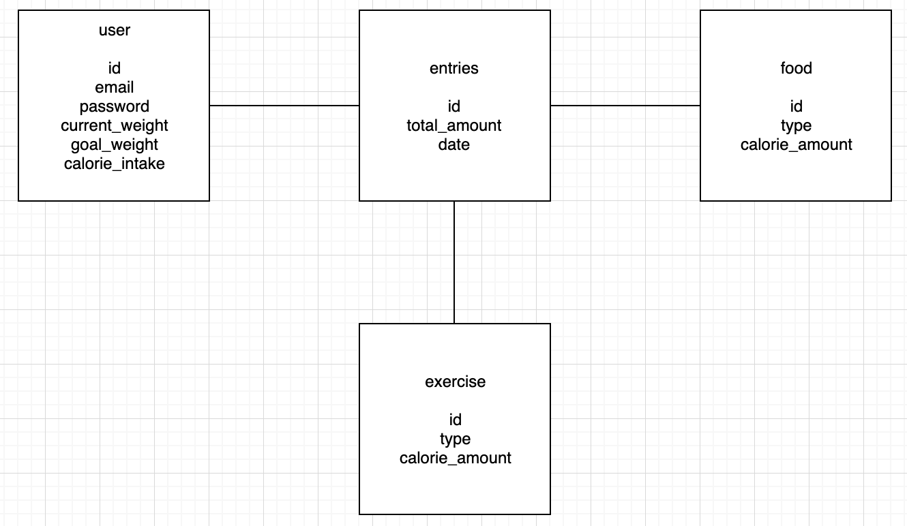

# best-life

# Project Description
-A fitness application to show the users daily calorie intake and log food eaten and weight lost/gained
Since there can be many functionality that can be added, we are going to focus on mvp using the moscow method.   
-Mvp- the ability for users to sign in and log their daily calorie intake every time they eat or exercise and to see their progress.   
-Pmvp- individual users can add certain foods to the database so other users don’t have to find out what foods have certain amount of calories  
 
# MVP
Login/registration  
Model- user’s username/email and password. create/update user  
View- login and registration form  
Controller- post username and password  

User statistics/goals  
Model- user’s current weight and goal weight. create/read/update weights  
View- user stats  
Controller- get/post/update weight  
 
User total daily intake  
Model- user’s total daily calorie intake, create/read/update daily intake  
View- total daily intake amount, date  
Controller- get/post/put total daily intake  
 
User food intake/exercise  
Model- food calorie intake, create/read/update/delete daily intake  
View- list of foods eaten/exercise performed and calories gained/lost  
Controller- get/post/put/delete food calorie/exercises  
 

# API Endpoints

USER  
{   
  "id": 1,   
  "username/email": "JohnSmith256346@fakemail.com",  
  "password": "ertekjegt533*",  
  "current_weight": 210,  
  "goal_weight": 180,  
  "calorie_limit": 1700,  
  "created_by": 0,  
  "created_at": "2018-12-14T15:37:11.578Z",  
  "updated_at": "2018-12-14T15:37:12.563Z",  
}

 
ENTRY  
{  
  "id": 1,  
  "total_amount": 1600,  
  "date": "2018-12-14",  
  "created_by": 0,  
  "created_at": "2018-12-14T15:37:11.578Z",  
  "updated_at": "2018-12-14T15:37:12.563Z",  
  "user": 1  
}
 
FOOD  
{  
  "id": 1,  
  "type": "banana",  
  "calorie_amount": 100,  
  "created_by": 0,  
  "created_at": "2018-12-14T15:37:11.578Z",  
  "updated_at": "2018-12-14T15:37:12.563Z",  
  "daily_calorie_intake": 1  
}

EXERCISE  
{  
  "id": 1,  
  "type": "push-ups",  
  "calorie_amount": 100,  
  "created_by": 0,  
  "created_at": "2018-12-14T15:37:11.578Z",  
  "updated_at": "2018-12-14T15:37:12.563Z",  
  "daily_calorie_intake": 1  
}

# Component Hierarchy
LoginPage  
-> LoginForm  
Dashboard  
-> JournalEntry  
   -> Food  
   -> Exercise  
   -> Total  
   -> NewEntry  
   -> UpdateJournal  
-> Stats  
   -> UpdateStats  
 
Dependencies- backEnd: morgan, express, pg, body-parser, cors, sequelize, nodemon  
 frontEnd: axios, react, react-router-dom, react-dom, react-scripts  
